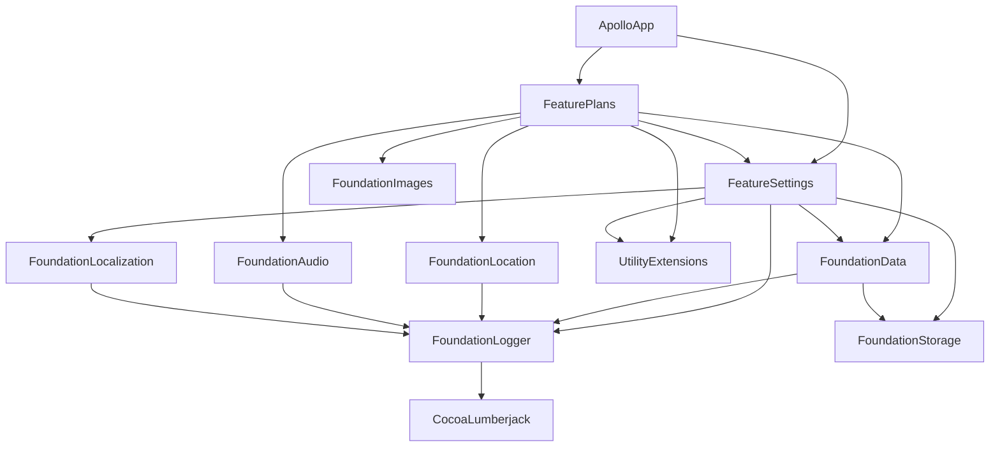

# Apollo

<p align="center">
    
</p>


[](https://github.com/NikolaGrujic91/garden_planner_app/graphs/commit-activity)
[](https://www.gnu.org/licenses/gpl-3.0)
[](https://github.com/lukepistrol/SwiftLintPlugin)
[](https://github.com/nicklockwood/SwiftFormat)

## Table of contents

* [General info](#general-info)
* [Features](#features)
* [Usage](#usage)
* [Requirements](#requirements)
* [Architecture](#architecture)
* [Fastlane](#fastlane)
* [Dependency graph](#dependency-graph)
* [License](#license)

## General info

Apollo is a running tracker app.

Available on iOS.

## Features

* Running plans:
  * 0 to 2K
  * 0 to 5K
  * 5K to 10k
  * Weight Loss: Level 1
  * Weight Loss: Level 2
  * Weight Loss: Level 3
* Distance tracking
* Calories burned
* Integrated with Apple Health for reading weight
* Works completely offline
* Dark theme
* Languages (en, nl)
* Swipe between tabs

## Usage

<p align="middle">
  
  
  
  
  
  
</p>

## Requirements

This project requires:

* XCode 14
* iOS 16 (device or simulator)

## Architecture

Architecture of the application is based on the microapps/microfeatures architecture.

[Meet the microapps architecture](https://increment.com/mobile/microapps-architecture/)

[Get started/Building at scale/µFeatures Architecture](https://docs.tuist.io/tutorial/get-started)



## Fastlane

```shell
brew install fastlane
```

## Available Actions

Navigate to *fastlane* folder and run actions from terminal.

### Build debug

```shell
fastlane ios build_debug
```

### Build release

```shell
fastlane ios build_release
```

### Create screenshots

```shell
fastlane ios screenshots
```

### Tests with code coverage

```shell
fastlane ios tests
```

## Dependency graph

Detailed dependency graph can be found at:

```text
./DependencyGraph/html/emerge.html
```

It is generated using the [emerge](https://github.com/glato/emerge)

Install emerge:

```shell
./Scripts/emerge/install_emerge.sh
```

Generate new dependency graph:

```shell
./Scripts/emerge/run_emerge.sh
```

## License

This project is licensed under the GNU GPL v3 License - see the [LICENSE.md](https://github.com/NikolaGrujic91/Apollo-iOS/blob/master/LICENSE.md) file for details.